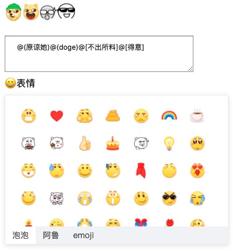

# Vue-Emoji-Box
[](https://www.npmjs.com/package/vue-emoji-box) [](https://bundlephobia.com/result?p=vue-emoji-box@latest) [](https://vuejs.org/) 



## 目录
- [示例](#示例)
  - [codesandbox](#codesandbox)
- [本地运行](#本地运行)
- [安装](#安装)
- [使用说明](#使用说明)
    - [组件注册](#组件注册)
    - [renewHtml](#renewHtml)
    - [ssr使用](#ssr使用)
- [Props](#props)
    - [targetId](#targetId)
    - [value](#value)
    - [baseUrl](#baseUrl)
    - [customEmojis](#customEmojis)
    - [customCategories](#customCategories)
    - [className](#className)
    - [visible](#visible)
    - [label](#label)
    - [width](#width)
    - [height](#height)
- [Events](#events)
    - [change](#change)
----

# 示例

### codesandbox

[](https://codesandbox.io/s/vue-emoji-box-i4n76?fontsize=14&hidenavigation=1&module=%2Fsrc%2FApp.vue&theme=dark)


# 本地运行
```bash
git clone https://github.com/ZhanPhty/vue-emoji-box.git

cd vue-emoji-box

yarn 或 npm install

yarn serve 或 npm run serve
```

# 插件安装
```bash
yarn add vue-emoji-box
```
# 使用说明
1.默认使用emoji字符表情，可自定义表情数据
[第三方表情包](https://share.weiyun.com/5DwsXiL)，表情包资源建议存放在cdn或本地静态资源目录‘/public’
2.组件提供`renewHtml()`方法，用于将表情字符渲染成对应的表情图片富文本

### 组件注册
> 局部注册

```vue
<template>
  <div id="app">
    <div v-html="renewHtml()"></div>
    <VueEmojiBox />
  </div>
</template>

<script>
import VueEmojiBox, { renewHtml } from 'vue-emoji-box'

export default {
  components: {
    VueEmojiBox
  }
}
</script>
```

> 全局注册

```js
import Vue from "vue"
import App from "./App.vue"

import VueEmojiBox from 'vue-emoji-box'

Vue.use(VueEmojiBox)

new Vue({
  render: h => h(App)
}).$mount("#app")
```

### renewHtml
表情有'emoticon'与'image'两种类型，emoticon用于字符表情（emoji或颜文字），image则是图片包表情。（数据格式查看：`$Props.customEmojis`、`$Props.customCategories`）

图片表情包在选择时会使用特定的字符串标识，提交的数据实际是字符串而非图片，所以在返回数据的时候得到的也是特定的字符串。

提供`renewHtml`方法用于将这些特定的字符串恢复成``富文本表情的形式展示表情包

`renewHtml`有4个参数
- html: string  需要转化的html数据
- category: string[]  项目中使用到的表情包分类数据
- emojis: string[]  项目中使用到的表情包数据
- baseUrl: string  表情包存放的初始url

```vue
<template>
  <div id="app">
    <div class="html" v-html="renewHtml(html: string, category: string[], emojis: string[], baseUrl: string)"></div>
  </div>
</template>

<script>
import { renewHtml } from 'vue-emoji-box'

export default {
  methods: {
    renewHtml
  }
}
</script>
```

### ssr使用
以nuxt.js为例

```vue
<template>
  <div id="app">
    <client-only>
      <VueEmojiBox />
    </client-only>
  </div>
</template>
```

# Props

| Prop | Type | Default |
| --- | --- | --- |
| targetId | String |  |
| value / v-model | String |   |
| baseUrl | String | ‘/' |
| customEmojis | String[] | emojisDefault[] |
| customCategories | String[] | categoriesDefault[] |
| className | String |  |
| visible | Boolean | false |
| label | String or Boolean or slot| '表情' | 
| width | String | '380px' |
| height | String | '200px' |

### targetId

类型:`string`

用于直接绑定input、textarea、div的Id属性，将选择的表情数据直接插入到光标位置
*注：设置`targetId`同时可使用v-model方式获取插入表情后的完整数据*

```vue
<textarea id="demoText" />
<VueEmojiBox targetId="demoText" />
```

### value

类型:`string`

双向绑定，返回插入表情后的完整数据，必须设置`targetId`
```vue
<div>{{ textareaVal }}</div>
<textarea id="demoText" />
<VueEmojiBox targetId="demoText" v-model="textareaVal" />
```

### baseUrl

类型:`string`
默认值: `/`

使用第三方表情包时，设置初始url，支持本地资源或网络资源
```vue
<VueEmojiBox baseUrl="https://www.xxx.com/" />
```

### customEmojis

类型:`string[]`
默认值: `emoji[]`

自定义表情包数据，配合`baseUrl`
```js
// 资源最后路径(${baseUrl}${customEmoji.data})
// https://www.xxx.com/paopao/啊@2x.png
[{ 
    data: 'paopao/啊@2x.png', // 文件存放目录
    text: '啊', // 对应的显示文字
    category: 'paopao' // 类别
}]
```

### customCategories

类型:`string[]`
默认值: `category[]`

自定义表情分类数据
```js
[{
    id: 'paopao',  // 类别id
    name: '泡泡', // 类别名称
    icon: '', // 类别icon，显示优先级高于name
    textPattern: '@(${value})', // 表情字符串标识，定义是必须存在'${value}'，如：$[${value}]、$<${value}>
    type: 'image' // 类别类型， 可选值 'emoticon' | 'image'
}]
```

### className

类型:`string`

设置class
```vue
<VueEmojiBox className="demoClass" />
```

### visible

类型:`boolean`
默认值: `false`

控制组件显示
```vue
<VueEmojiBox :visible="true" />
```

### label

类型:`string | boolean | slot`
默认值: `表情`

表情名称，可用于触发显示，设置false则隐藏。可用slot定制样式
```vue
<VueEmojiBox label="🙂表情" />

or

// slot
<VueEmojiBox>
    <button #label>label="🙂表情"</button>
</VueEmojiBox>
```

### width

类型:`string`
默认值: `380px`

宽度
```
<VueEmojiBox width="300px" />
```

### height

类型:`string`
默认值: `200px`

高度
```
<VueEmojiBox height="200px" />
```

# Events

| Event | Introduction |
| --- | --- | 
| change | 选择表情时触发 |

### change
```vue
<VueEmojiBox @change="onChange"  />

onChange(item) {
    console.log(item)
}
```

# 联系

QQ：461632311

个人博客：[https//www.uizph.com](https//www.uizph.com)

